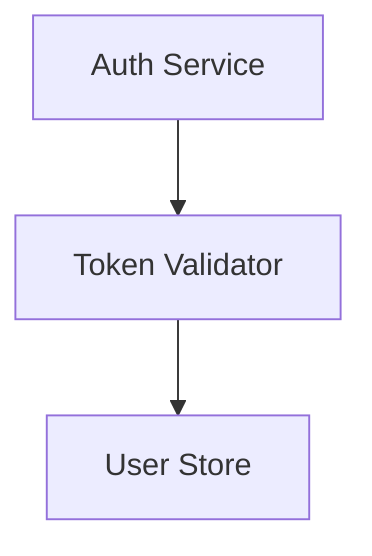
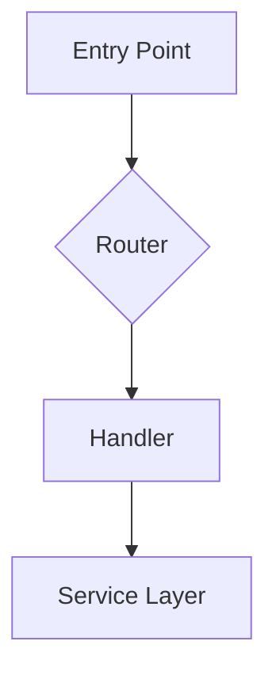
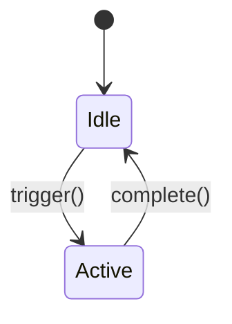
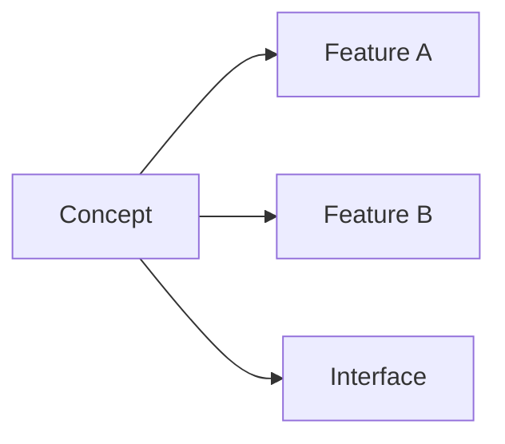
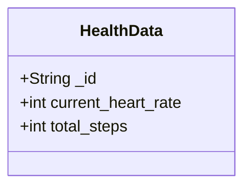

# Doctrack — Codebase Knowledge Graph

You maintain a **knowledge graph** of project documentation in a local Obsidian vault (`.doctrack/`). The vault travels with the code in git — it's the project's persistent memory across sessions and team members.

**This skill depends on the obsidian skill** (`bitbonsai/mcpvault`) for all vault operations. The obsidian skill handles MCP tool usage, Obsidian CLI, and git sync. Doctrack focuses on **what** knowledge to capture and **how** to structure it — not the mechanics of reading/writing notes.

If the obsidian skill or MCP tools are not available, doctrack init will set them up automatically (see Pre-init).

## Knowledge graph structure

The vault contains these **node types**, connected by `[[wikilinks]]`:

| Node | Directory | Purpose | Audience |
|------|-----------|---------|----------|
| **Features** | `features/` | What the system does. High-level functional units. | Claude |
| **Components** | `components/{feature}/` | How pieces work internally. Dense implementation details. | Claude |
| **Concepts** | `concepts/` | Cross-cutting ideas and patterns spanning multiple features. | Claude + Human |
| **Decisions** | `decisions/` | Why things are the way they are — including rejected alternatives. | Claude + Human |
| **Interfaces** | `interfaces/` | Contracts and boundaries between features or packages. | Claude + Human |
| **Guides** | `guides/` | Procedural docs only: build, deploy, test, setup workflows. | Human |
| **Specs** | `specs/` | Machine-readable specifications (OpenAPI, schemas). | Machine |
| **References** | `references/` | Imported pre-existing docs and user-provided materials. | Claude |

**Wikilinks are the edges.** Every note should link to related notes — features link to their components, components link to interfaces they implement, concepts link to the features they span, decisions link to what they affect. This is what makes the vault navigable in Obsidian's graph view.

**Use Mermaid for all diagrams.** More token-efficient than ASCII art, natively rendered by Obsidian, and structured enough to parse and update programmatically. Use it for flowcharts, sequence diagrams, state machines, ER diagrams, class diagrams, and dependency graphs. Avoid ASCII art entirely.

**Linking notes in Mermaid diagrams.** To make Mermaid nodes clickable links to other notes, use Obsidian's `internal-link` class — NOT wikilink syntax inside node labels:



The node label text must match the note filename (without `.md`). Nodes with the `internal-link` class become clickable in Obsidian's reading view. **Never put `[[wikilinks]]` inside Mermaid code blocks** — use wikilinks only in regular markdown content outside of code fences.

**Avoid hex colors in Mermaid.** Do NOT use `classDef` with hex color fills (e.g., `classDef internal fill:#e1f5fe`). Obsidian interprets `#e1f5fe` inside code blocks as an inline hashtag and creates a spurious tag. If you need styling, use named CSS classes without `#` hex values, or skip styling entirely — the diagrams are informational, not decorative.

## Tag taxonomy

Every note gets **three required tags** (applied via the obsidian skill's tag management):

| Category | Tags |
|----------|------|
| **Type** | `doctrack/type/feature`, `component`, `concept`, `decision`, `interface`, `guide`, `reference`, `spec`, `index` |
| **Status** | `doctrack/status/active`, `deprecated`, `draft`, `rejected` |
| **Audience** | `doctrack/audience/claude`, `human`, `machine` |

Additional: `doctrack/project/{name}` (shared vaults), `doctrack/package/{name}` (monorepos).

## When to use this

**After making code changes**: Update relevant documentation before finishing your response.

**At session start**: Run session init to orient yourself from previous sessions.

**When the user asks**: Documenting, updating docs, syncing, or generating documentation.

**To initialize a project**: When the user says "doctrack init".

**Do NOT use for**: Trivial formatting changes, comment-only edits, or read-only exploration.

## Session init (every session)

Runs at the start of every Claude session in a project with doctrack. Idempotent.

1. **Detect vault and init state**: Check if `.doctrack/` exists on the filesystem.
   - If `.doctrack/` exists but `_project.md` doesn't → post-restart after dependency setup. Tell the user: "Your doctrack vault is set up. Say `doctrack init` to continue."
   - If `_project.md` exists and contains a `Current phase` field that is NOT `complete` → **interrupted init**. Check which phase it's in and summarize progress. Tell the user: "Doctrack init was interrupted during {phase}. Say `doctrack init` to resume where we left off."
   - If `.doctrack/` doesn't exist → check `CLAUDE.md` for vault path info.

2. **Verify MCP connection**: Check if `mcp__obsidian__*` tools are available.
   - If tools are available → try reading `_project.md` via MCP. If it works, proceed to step 3.
   - If tools are available but can't reach the vault → the MCP server may be pointing elsewhere. Check `.mcp.json` to see if it has the right vault path. If not, update it.
   - If tools are NOT available → check if `.mcp.json` exists with an obsidian server config. If not, create it:
     ```json
     {
       "mcpServers": {
         "obsidian": {
           "command": "npx",
           "args": ["@bitbonsai/mcpvault@latest", "{absolute-path-to-project}/.doctrack"]
         }
       }
     }
     ```
     Tell the user: "I've configured the MCP server in `.mcp.json`. Please restart Claude Code for the connection to activate." Then proceed with what you can do without MCP (read `.doctrack/` files directly from the filesystem using the Read tool as a fallback).

3. **Read project config**: Load `_project.md` from the vault. Check `doctrack_version` (see Version tracking).

4. **Orient**: Use vault stats to see recently modified notes. Load only docs relevant to the current task — don't read the whole vault.

## Vault layout

### Local vault (default)

```
project-root/
├── .doctrack/                      # Obsidian vault — committed to git
│   ├── .obsidian/                  # Obsidian config
│   ├── _project.md                 # Project config — always read first
│   ├── features/
│   ├── components/
│   ├── concepts/
│   ├── decisions/
│   ├── interfaces/
│   ├── guides/
│   ├── specs/
│   └── references/
├── README.md
├── CLAUDE.md
└── src/
```

### Monorepo

```
.doctrack/
├── _project.md                     # Root: package map, cross-package deps
├── packages/
│   └── {package-name}/
│       ├── _package.md
│       ├── features/ components/ concepts/ decisions/ interfaces/
│       └── ...
├── concepts/                       # Monorepo-wide concepts
├── decisions/                      # Monorepo-wide decisions
├── interfaces/                     # Cross-package contracts
├── guides/
└── references/
```

### Shared vault (multi-project)

Notes namespaced under `projects/{name}/`. A `_doctrack.md` at vault root lists all projects.

## Note templates

### `_project.md` (project config)

```markdown
---
project: {project-name}
type: index
doctrack_version: "2.0.0"
monorepo: false
initialized: YYYY-MM-DD
last_updated: YYYY-MM-DD
---

# {Project Name}

## Features

| Feature | Note | Description | Status |
|---------|------|-------------|--------|

## File Registry

List individual source files, not directories. Each row maps a specific file to its feature and component.

| Source File | Feature | Component |
|------------|---------|-----------|
| src/controllers/UserController.java | user-management | user-controller |
| src/services/AuthService.java | authentication | auth-service-impl |
```

Tags: `doctrack/type/index`, `doctrack/status/active`, `doctrack/audience/claude`

### Feature note (`features/{name}.md`)

```markdown
---
feature: feature-name
type: feature
doctrack_version: "2.0.0"
files:
  - src/path/to/file.ts
last_updated: YYYY-MM-DD
status: active
---

# Feature Name

## Purpose
What this feature does and why it exists.

## Architecture



## Key Files
- `src/path/to/file.ts` — Main entry point

## Dependencies
- **Internal**: [[features/auth|Authentication]]
- **Concepts**: [[concepts/health-data-model|Health Data Model]]
- **Interfaces**: [[interfaces/api-contract|API Contract]]
- **External**: express, lodash

## API Surface
Key exports, endpoints, or interfaces.

## Notes
Gotchas, tech debt, planned changes.
```

Tags: `doctrack/type/feature`, `doctrack/status/active`, `doctrack/audience/claude`

### Component note (`components/{feature}/{name}.md`)

```markdown
---
feature: parent-feature
type: component
files:
  - src/path/to/component.ts
last_updated: YYYY-MM-DD
status: active
---

# Component Name

## Responsibility
Single-sentence description.

## Internal Logic



## Relationships
- **Used by**: [[features/auth|Authentication]]
- **Depends on**: [[features/database|Database]]
- **Implements**: [[interfaces/session-contract|Session Contract]]
```

Tags: `doctrack/type/component`, `doctrack/status/active`, `doctrack/audience/claude`

### Concept note (`concepts/{name}.md`)

Cross-cutting ideas that span multiple features. Create one when a pattern, model, or architectural idea connects disparate parts of the codebase.

```markdown
---
type: concept
related_features:
  - feature-a
  - feature-b
last_updated: YYYY-MM-DD
status: active
---

# Concept Name

## What it is
Clear explanation and why it matters.

## Where it appears



- [[features/feature-a|Feature A]] — How it uses this concept
- [[features/feature-b|Feature B]] — How it uses this concept

## Key decisions
- [[decisions/relevant-decision|Why we chose this approach]]
```

Tags: `doctrack/type/concept`, `doctrack/status/active`, `doctrack/audience/claude`

### Decision note (`decisions/{name}.md`)

Records **why** something was built a certain way — including rejected alternatives. This prevents re-proposing approaches that were already considered.

```markdown
---
type: decision
status: accepted|rejected|superseded
date: YYYY-MM-DD
superseded_by: other-decision  # only if superseded
related_features:
  - feature-a
last_updated: YYYY-MM-DD
---

# Decision: Title

## Status
**Accepted** | **Rejected** | **Superseded by [[decisions/other|Other]]**

## Context
What problem were we solving? What constraints existed?

## Decision
What we chose (or chose NOT to do, if rejected).

## Alternatives considered

| Alternative | Pros | Cons | Why rejected |
|-------------|------|------|-------------|
| Option A | Fast | Fragile | Couldn't handle scale |
| Option B | Simple | Limited | Missing feature X |

## Consequences
What changed. Trade-offs accepted. Known limitations.
```

Tags: `doctrack/type/decision`, `doctrack/status/{accepted|rejected}`, `doctrack/audience/claude`

**When to create decisions:**
- Non-trivial architectural choices
- When you or the user reject an approach — document why
- When the user says "we tried X and it didn't work because Y"
- When a decision constrains future work

### Interface note (`interfaces/{name}.md`)

Contracts between features or packages — boundaries where different parts meet.

```markdown
---
type: interface
implementors:
  - feature-a
  - feature-b
consumers:
  - feature-c
last_updated: YYYY-MM-DD
status: active
---

# Interface: Name

## Contract



## Implementors
- [[features/feature-a|Feature A]] — Produces this data

## Consumers
- [[features/feature-c|Feature C]] — Receives and validates

## Validation rules
Key constraints on the contract.
```

Tags: `doctrack/type/interface`, `doctrack/status/active`, `doctrack/audience/claude`

### Guide note (`guides/{name}.md`)

**Procedural docs only** — things a developer follows step-by-step.

Valid guides: `deployment.md`, `development.md`, `setup.md`, `testing.md`

NOT guides: architecture overviews (→ concepts), feature explanations (→ features), API docs (→ specs/interfaces).

Tags: `doctrack/type/guide`, `doctrack/status/active`, `doctrack/audience/human`

## Important principles

1. **Read before writing.** Search for existing notes before creating new ones.

2. **Dense internal docs.** Features and components are for Claude — pack them with information.

3. **Document decisions, especially rejections.** The "why not" is as valuable as the "why."

4. **Concepts connect the graph.** When a pattern spans features, create a concept note and link everything to it.

5. **Interfaces define boundaries.** When features communicate, document the contract.

6. **Guides are procedural only.** Build, deploy, test, setup. Not explanations.

7. **Mermaid everywhere.** All diagrams. No ASCII art. Use `class NodeId internal-link;` to make nodes clickable links to notes — never put `[[wikilinks]]` inside Mermaid code blocks.

8. **Incremental updates.** Surgical edits, not full rewrites.

9. **Timestamp everything.** Update `last_updated` on every modification.

10. **Local vault is the default.** `.doctrack/` in the project directory, committed to git.

11. **Wikilinks are edges.** Every cross-reference uses `[[path|Display]]` syntax.

---

## Version tracking and migration

Current version: `2.0.0`.

### Version history

| Version | Key changes |
|---------|-------------|
| **1.x** | Filesystem-only (`.claude_docs/` + `docs/`). Docs as files in repo. |
| **2.0** | Local Obsidian vault (`.doctrack/`). Knowledge graph (concepts, decisions, interfaces). Mermaid diagrams. Depth-first init. Delegates vault I/O to obsidian skill (mcpvault). |

### Version checking (during session init)

After reading `_project.md`, check `doctrack_version`:

1. **Missing** → v1.x filesystem docs. Offer migration.
2. **Matches** → proceed normally.
3. **Same major, older minor** → proceed, silently update version stamp.
4. **Older major** → inform user, offer migration. Don't auto-migrate.
5. **Newer than skill** → warn user, proceed carefully.

### Migration: v1 → v3

When `.claude_docs/` exists but no `.doctrack/`:

1. Read v1 docs (index, features, components — they have structured frontmatter)
2. Create `.doctrack/` vault with `.obsidian/` and `.gitignore`
3. Convert v1 notes to vault notes (convert cross-refs to wikilinks, add tags)
4. Extract implicit concepts and decisions from v1 content
5. Write `_project.md` from v1 index
6. Write `CLAUDE.md` section
7. Ask user: archive or clean up old `.claude_docs/` and `docs/`

### Migration: v2 → v3

When `_project.md` exists with `doctrack_version: "2.x"`:

1. Add `concepts/`, `decisions/`, `interfaces/` directories
2. Move non-procedural guides to `concepts/` or deprecate
3. Convert ASCII art to Mermaid in existing notes
4. Update version stamp
5. If vault is external, offer to move to local `.doctrack/`

---

## Project initialization

When the user says "doctrack init" or asks to document a project.

### Pre-init

#### Step 1: Install dependencies

**Check for obsidian skill**: Look for `mcp__obsidian__*` tools in the available tools.

If MCP tools are NOT available:
1. Check if `.mcp.json` exists in the project root. If it has an `obsidian` server entry, the MCP server is configured but Claude Code needs a restart.
2. If no `.mcp.json`, check if the obsidian skill is installed by looking for `.claude/skills/obsidian/` or `.agents/skills/obsidian/`.
3. If the obsidian skill is not installed, install it:
   ```bash
   npx skills add bitbonsai/mcpvault --yes
   ```
4. Create or update `.mcp.json` in the project root:
   ```json
   {
     "mcpServers": {
       "obsidian": {
         "command": "npx",
         "args": ["@bitbonsai/mcpvault@latest", "{absolute-path-to-project}/.doctrack"]
       }
     }
   }
   ```
   If `.mcp.json` already exists with other servers, merge the `obsidian` entry — don't overwrite existing config.
5. Also create the `.doctrack/` directory, `.doctrack/.obsidian/`, and `.doctrack/.gitignore` now — so the vault path in `.mcp.json` is valid when the MCP server starts.
6. **STOP and tell the user to restart.** This is critical — you MUST clearly tell the user:

   > "I've set up the doctrack dependencies:
   > - Installed the obsidian skill (mcpvault)
   > - Configured the MCP server in `.mcp.json`
   > - Created the `.doctrack/` vault directory
   >
   > **Please restart Claude Code** (exit and relaunch), then say `doctrack init` again. The MCP server needs a restart to connect to the vault."

   After delivering this message, **do not continue with init**. Do not attempt to write vault notes, create features, or do any documentation work. The MCP connection will not be available until after the restart. End your response here.

If MCP tools ARE available → proceed to step 2.

#### Step 2: Create local vault

- Create `.doctrack/` directory on the filesystem
- Create `.doctrack/.obsidian/` for Obsidian config
- Write `.doctrack/.gitignore`:
  ```
  .obsidian/workspace.json
  .obsidian/workspace-mobile.json
  .obsidian/appearance.json
  .obsidian/hotkeys.json
  .obsidian/app.json
  .obsidian/graph.json
  ```
- Verify MCP can reach the vault: try a simple `get_vault_stats` call. If it fails, the MCP server may be pointed at a different path — update `.mcp.json` and tell the user to restart.
- Open the vault in Obsidian via the obsidian skill's CLI: `obsidian open path="{absolute-path}/.doctrack"`. If Obsidian CLI isn't available, tell the user: "Open `.doctrack/` as a vault in Obsidian to browse the knowledge graph."

#### Step 3: Detect project name

From `package.json` `name` field, directory name, or ask the user.

#### Step 4: Check for existing doctrack data

- `.claude_docs/` on filesystem → v1, offer migration (see Version tracking)
- `_project.md` in vault → already initialized, ask to re-init or abort

#### Step 5: Check for monorepo

`workspaces` in `package.json`, `pnpm-workspace.yaml`, `lerna.json`, `turbo.json`, `nx.json`, `packages/`/`apps/`/`services/` dirs, or multiple `.git` dirs under one parent.

### Init strategy: depth-first, write-as-you-go, resumable

Doctrack uses a **depth-first** approach with **immediate writes** and **checkpoint tracking**. This is critical for large projects where sessions may be interrupted by usage limits, timeouts, or restarts.

**Core principles:**
- Process one module at a time in depth, not all modules broadly
- Write each note to the vault **immediately** after creating it — don't batch writes
- Checkpoint progress in `_project.md` after each module completes
- On resume, detect what's already documented and continue where you left off

### Phase 1: Lightweight discovery

Read **only build config and directory structure** — do not read source files yet.

1. **Read build config** — `pom.xml`, `package.json`, `build.gradle`, `Cargo.toml`, etc. Identify modules/packages and their dependencies.
2. **List modules** — from build config or top-level directories. For each module, note: name, path, estimated size (file count via glob).
3. **Import existing docs** — this step is important, don't skip it. Search the project for:
   - `README.md` at root and in each module
   - `CLAUDE.md` with project context
   - `docs/`, `documentation/`, `wiki/` directories
   - Architecture decision records (`adr/`, `decisions/`)
   - API specs, design docs, runbooks, `.md` files in non-source directories

   For each found doc, write it to `references/imported/{filename}.md` in the vault with frontmatter including `original_path`. Tag with `doctrack/type/reference`. These are valuable source material — they often contain architectural context, decisions, and domain knowledge not visible in code.

   Ask user about archiving filesystem copies to `.doctrack/archive/`.
4. **Sort modules by dependency order** — foundation/shared modules first. If unclear, smallest first.
5. **Write initial `_project.md`** — module list with a `Status` column tracking init progress:

```markdown
## Init Progress

Current phase: **phase-1**

### Modules

| Module | Files | Status | Components |
|--------|-------|--------|------------|
| ci-model | 43 | pending | — |
| ci-common | 11 | pending | — |
| story-service | 300 | pending | — |

### Phase 3 Checklist

| Category | Target | Created | Status |
|----------|--------|---------|--------|
| Concepts | 6-10 | 0 | pending |
| Decisions | 5-8 | 0 | pending |
| Interfaces | 4-8 | 0 | pending |
| References | all docs | 0 | pending |
| README | — | — | pending |
| CLAUDE.md | — | — | pending |
| Guides | — | — | pending |
```

This is the **checkpoint**. It tracks progress across ALL phases:

- **`Current phase`** — which phase the init is in (`phase-1`, `phase-2`, `phase-3`, `phase-4`, `complete`). Updated when transitioning between phases.
- **Modules table** — Phase 2 progress. Update each module to `done` with component count after completing it.
- **Phase 3 Checklist** — tracks cross-cutting note creation. Update `Created` count and `Status` after writing each category. This prevents Phase 3 from re-running on resume if it already completed.

On resume, read this checkpoint to determine:
1. Which phase to start from
2. Which modules still need documenting (Phase 2)
3. Which Phase 3 categories still need work

### Phase 2: Deep-dive modules (depth-first, write-as-you-go)

Process modules **one at a time** (or 2-3 independent modules in parallel). For each module, follow this sequence — **writing each note immediately, not batching**:

**Step A: Read source files** for this module in small groups (5-10 files at a time for large modules). As you read each group, identify what component it belongs to.

**Step B: Write the feature note immediately.** Don't wait until you've read all files — write a draft feature note after reading enough to understand the architecture (first 10-15 files). You can patch it later with additional details. Getting the note into the vault early means it survives interruption.

**Step C: Write each component note as you identify it.** This is the critical change from batch writing: as soon as you understand a logical unit (a controller, a service, a model group), write its component note immediately. Then move to the next group of source files. This way, if the session ends mid-module, the components you've already written are preserved.

**Component notes are not optional.** Guidelines:

| Module size | Expected components |
|------------|-------------------|
| 1-2 files | 0 (feature note is sufficient) |
| 3-10 files | 2-5 components |
| 10-30 files | 5-15 components |
| 30-100 files | 15-30 components |
| 100+ files | 30+ components |

**Step D: Tag each note immediately after writing it.** Don't defer tagging to a batch step.

**Step E: Checkpoint.** After finishing a module (feature + all components), update `_project.md` via `patch_note`:
- Set `Current phase` to `phase-2` (if not already)
- Set this module's row in the Modules table to `done` with component count
- Add file registry entries for this module (individual source files)
- This is the checkpoint — if the session ends here, the next session knows this module is complete

**Step F: Note cross-cutting observations** as you go — shared patterns, architectural choices, contracts. Collect these for Phase 3 but don't write them yet.

**Step G: Move to the next module.**

**Parallelization**: Spawn subagents for 2-3 independent modules at a time — but each subagent must follow the write-as-you-go pattern internally. Don't spawn all modules in parallel.

Give each subagent this context:
```
You are documenting the "{module-name}" module for doctrack. Go DEEP.

Module path: {path}
Source files: {count} files
Module dependencies: {list of other modules this depends on}
Already-documented modules (for cross-referencing): {list with vault paths}

CRITICAL: Write each note IMMEDIATELY after creating it — do NOT batch writes.
The session may end at any time due to usage limits. Every note you write to
the vault before that happens is preserved. Every note you defer is lost.

Workflow:
1. Read source files in groups of 5-10
2. Write features/{module-name}.md as soon as you understand the architecture
3. Write components/{module-name}/{component}.md ONE AT A TIME as you identify each
4. Tag each note immediately after writing
5. Return: vault paths created + file registry entries (individual files)

A module with {count} files should produce roughly {count/5 to count/3} components.
Use internal-link class in Mermaid nodes. Use [[wikilinks]] in markdown content only.
Do NOT use classDef with hex colors (#e1f5fe etc.) — Obsidian creates spurious tags.
Vault paths must be clean note paths (e.g., features/auth.md, components/auth/token.md).
Never write notes with paths containing wildcards, code patterns, or Java package names.
```

### Phase 3: Build cross-cutting knowledge graph

Update `Current phase` to `phase-3` in `_project.md` before starting.

After all modules are documented (or as many as completed before interruption), this phase is equally important as Phase 2 — it's what turns isolated feature docs into a connected knowledge graph. Don't rush or skip it.

**Write each note immediately** (same write-as-you-go principle as Phase 2). **Checkpoint after each sub-phase** by updating the Phase 3 Checklist in `_project.md`.

#### 3a. Concept notes

Create concept notes for every cross-cutting pattern that spans 2+ modules. Review the features you documented — what patterns appeared repeatedly?

**Minimum guideline**: A project with N modules should have roughly N/3 to N/2 concept notes. An 18-module project should produce 6-10 concepts.

Common concepts to look for:
- Shared architectural patterns (event-driven messaging, circuit breaker, audit logging)
- Domain models that cross module boundaries
- Infrastructure patterns (service discovery, config management, security model)
- Data flow patterns (ingestion pipeline, processing pipeline)
- Operational patterns (monitoring, logging, deployment)

**Checkpoint**: After writing all concept notes, update the Phase 3 Checklist in `_project.md`: set Concepts row to `Created: {count}`, `Status: done`.

#### 3b. Decision notes

Create decision notes for every non-trivial architectural choice visible in the codebase. Look for:
- Technology choices (why this database? why this messaging system? why this framework?)
- Architectural patterns (why microservices? why event-driven? why this module structure?)
- Design tradeoffs visible in code comments, README, or existing docs
- Conventions that aren't obvious (why denormalized data? why this naming pattern?)

**Minimum guideline**: A project with N modules should have roughly N/3 decision notes. An 18-module project should produce 5-8 decisions. Each should include rejected alternatives.

**Checkpoint**: Update Decisions row in Phase 3 Checklist to `done` with count.

#### 3c. Interface notes

Create interface notes for every contract between modules. Look for:
- Shared DTOs/models passed between services
- REST API contracts between services (Feign clients, HTTP endpoints)
- Message schemas (Kafka topics, event formats)
- Database document schemas shared across modules
- Plugin/extension interfaces

**Minimum guideline**: A project with inter-service communication should have at least one interface per communication channel. An 18-module microservices project should produce 4-8 interface notes.

**Checkpoint**: Update Interfaces row in Phase 3 Checklist to `done` with count.

#### 3d. Import references

Import any pre-existing documentation that wasn't captured in Phase 1:
- README files from modules
- Existing docs/, wiki/, or documentation directories
- Architecture decision records (ADRs)
- API specs, design docs, runbooks
- CLAUDE.md files with project context

Write each to `references/imported/{filename}.md` in the vault. Tag with `doctrack/type/reference`.

**Checkpoint**: Update References row in Phase 3 Checklist to `done` with count.

#### 3e. Finalize project files and config

Write filesystem files and finalize the vault:
5. **Write `README.md`** on filesystem.
6. **Write `CLAUDE.md`** on filesystem (idempotent — read first, update or append):

```markdown
# Doctrack

This project uses a local doctrack vault at `.doctrack/`.
Project: `{project-name}` | Version: 2.0.0

## Session start
- Run doctrack session init to connect and load context
- Read relevant features and components for the area you'll work in
- Check concepts/ and decisions/ for cross-cutting context

## After code changes
- Update relevant feature/component notes
- Create decision notes for non-trivial choices (especially rejections)
- Update interfaces if contracts changed
- Update _project.md if new features or files added
```

7. **Write procedural guides** — `guides/development.md`, `guides/deployment.md` if applicable.
8. **Write specs** — `specs/openapi.md` if REST APIs exist.

### Phase 4: Verify completeness

Update `Current phase` to `phase-4` in `_project.md`.

1. **Cross-reference pass** — check wikilinks in Dependencies, Relationships, concept links, interface implementors.
2. **File registry audit** — compare source files against registry. Unmapped files → missed components.
3. **Component coverage check** — flag modules where file count vs component count suggests gaps.
4. **Set `Current phase` to `complete`** — remove the Init Progress section from `_project.md` or keep it as a record. The init is done.

### Resuming an interrupted init

When session init detects an Init Progress section in `_project.md`, read the `Current phase` and checklist to determine where to resume:

**If `Current phase` is `phase-1`**: Phase 1 is lightweight — just re-run it.

**If `Current phase` is `phase-2`**:
1. Tell the user: "Doctrack init was interrupted during module documentation. {N} of {M} modules are done. Want to continue?"
2. Process only modules with `pending` status.
3. Check `done` modules for component coverage — flag any with suspiciously low counts (e.g., 50 files but 0 components) for re-documentation.
4. After all modules complete, proceed to Phase 3.

**If `Current phase` is `phase-3`**:
1. Tell the user: "Doctrack init was interrupted during knowledge graph creation. Want to continue?"
2. Read the Phase 3 Checklist. Only run sub-phases still marked `pending` (e.g., if Concepts is `done` but Decisions is `pending`, start from 3b).
3. After Phase 3 completes, proceed to Phase 4.

**If `Current phase` is `phase-4`**: Re-run verification — it's cheap.

**If `Current phase` is `complete`**: Init is done. Don't re-run unless user explicitly asks to re-initialize.

This means large projects can be initialized across **multiple sessions** — each session makes progress, checkpoints it, and the next session picks up exactly where it left off.

### Init for monorepos

**Detection**: `workspaces`, `pnpm-workspace.yaml`, `lerna.json`, `turbo.json`, `nx.json`, multiple `go.mod`, `packages/`/`apps/`/`services/` dirs, or multiple `.git` dirs under one parent.

**Workflow** (same depth-first strategy, scoped to packages):
1. Lightweight discovery — detect packages, list them, sort by dependency order
2. Write root `_project.md` with Mermaid cross-package diagram and Init Progress table
3. Deep-dive each package (Phase 2 within `packages/{name}/`) — process 2-3 at a time, write-as-you-go
4. After all packages: create monorepo-level concepts, decisions, interfaces
5. Write root README and CLAUDE.md
6. Cross-reference pass across packages
7. Tag with `doctrack/package/{name}`

---

## Working with teams

All agents share the same vault via git. For concurrent access (multiple agents, worktrees):

- **Scope-based partitioning**: Each agent only updates notes for features it modifies.
- **Append-only for project config**: Use append mode for `_project.md` during concurrent work.
- **Advisory locking**: Check `editing_agent` frontmatter before updating shared notes.
- **Post-task reconciliation**: Consolidate appends, check for stale notes, clear locks, verify file registry.

For vault backup and git sync, use the obsidian skill's git sync capabilities.

## Naming conventions

- **Features**: kebab-case (`user-authentication.md`)
- **Components**: kebab-case (`token-validator.md`)
- **Concepts**: descriptive kebab-case (`health-data-model.md`)
- **Decisions**: verb-prefixed kebab-case (`chose-firestore.md`, `rejected-websockets.md`)
- **Interfaces**: kebab-case (`health-data-schema.md`)
