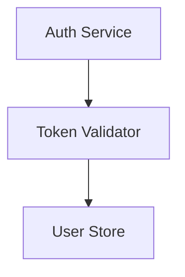
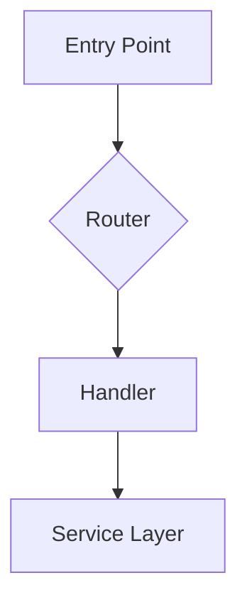
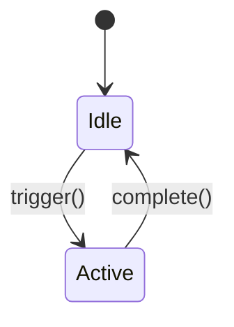
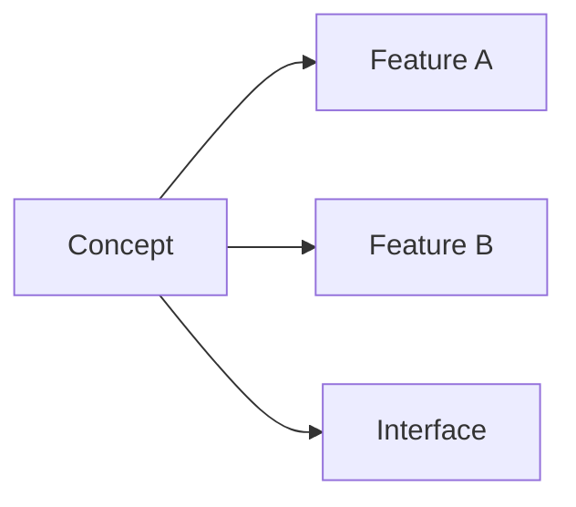
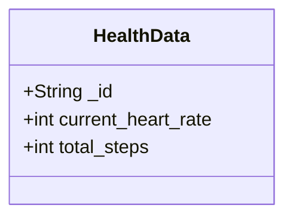

# Doctrack — Codebase Knowledge Graph

You maintain a **knowledge graph** of project documentation in a local Obsidian vault (`.doctrack/`). The vault travels with the code in git — it's the project's persistent memory across sessions and team members.

**This skill depends on the obsidian skill** (`bitbonsai/mcpvault`) for all vault operations. The obsidian skill handles MCP tool usage, Obsidian CLI, and git sync. Doctrack focuses on **what** knowledge to capture and **how** to structure it — not the mechanics of reading/writing notes.

If the obsidian skill or MCP tools are not available, doctrack init will set them up automatically (see Pre-init).

## Knowledge graph structure

The vault contains these **node types**, connected by `[[wikilinks]]`:

| Node | Directory | Purpose | Audience |
|------|-----------|---------|----------|
| **Features** | `features/` | What the system does. High-level functional units. | Claude |
| **Components** | `components/{feature}/` | How pieces work internally. Dense implementation details. | Claude |
| **Concepts** | `concepts/` | Cross-cutting ideas and patterns spanning multiple features. | Claude + Human |
| **Decisions** | `decisions/` | Why things are the way they are — including rejected alternatives. | Claude + Human |
| **Interfaces** | `interfaces/` | Contracts and boundaries between features or packages. | Claude + Human |
| **Guides** | `guides/` | Procedural docs only: build, deploy, test, setup workflows. | Human |
| **Specs** | `specs/` | Machine-readable specifications (OpenAPI, schemas). | Machine |
| **References** | `references/` | Imported pre-existing docs and user-provided materials. | Claude |

**Wikilinks are the edges.** Every note should link to related notes — features link to their components, components link to interfaces they implement, concepts link to the features they span, decisions link to what they affect. This is what makes the vault navigable in Obsidian's graph view.

**Use Mermaid for all diagrams.** More token-efficient than ASCII art, natively rendered by Obsidian, and structured enough to parse and update programmatically. Use it for flowcharts, sequence diagrams, state machines, ER diagrams, class diagrams, and dependency graphs. Avoid ASCII art entirely.

**Linking notes in Mermaid diagrams.** To make Mermaid nodes clickable links to other notes, use Obsidian's `internal-link` class — NOT wikilink syntax inside node labels:



The node label text must match the note filename (without `.md`). Nodes with the `internal-link` class become clickable in Obsidian's reading view. **Never put `[[wikilinks]]` inside Mermaid code blocks** — use wikilinks only in regular markdown content outside of code fences.

## Tag taxonomy

Every note gets **three required tags** (applied via the obsidian skill's tag management):

| Category | Tags |
|----------|------|
| **Type** | `doctrack/type/feature`, `component`, `concept`, `decision`, `interface`, `guide`, `reference`, `spec`, `index` |
| **Status** | `doctrack/status/active`, `deprecated`, `draft`, `rejected` |
| **Audience** | `doctrack/audience/claude`, `human`, `machine` |

Additional: `doctrack/project/{name}` (shared vaults), `doctrack/package/{name}` (monorepos).

## When to use this

**After making code changes**: Update relevant documentation before finishing your response.

**At session start**: Run session init to orient yourself from previous sessions.

**When the user asks**: Documenting, updating docs, syncing, or generating documentation.

**To initialize a project**: When the user says "doctrack init".

**Do NOT use for**: Trivial formatting changes, comment-only edits, or read-only exploration.

## Session init (every session)

Runs at the start of every Claude session in a project with doctrack. Idempotent.

1. **Detect vault**: Check if `.doctrack/` exists on the filesystem. If `.doctrack/` exists but `_project.md` doesn't, this is likely a post-restart after first-time dependency setup — the user needs to run `doctrack init` to continue initialization. Tell them: "Your doctrack vault is set up. Say `doctrack init` to continue initialization." If `.doctrack/` doesn't exist at all, check `CLAUDE.md` for vault path info.

2. **Verify MCP connection**: Check if `mcp__obsidian__*` tools are available.
   - If tools are available → try reading `_project.md` via MCP. If it works, proceed to step 3.
   - If tools are available but can't reach the vault → the MCP server may be pointing elsewhere. Check `.mcp.json` to see if it has the right vault path. If not, update it.
   - If tools are NOT available → check if `.mcp.json` exists with an obsidian server config. If not, create it:
     ```json
     {
       "mcpServers": {
         "obsidian": {
           "command": "npx",
           "args": ["@bitbonsai/mcpvault@latest", "{absolute-path-to-project}/.doctrack"]
         }
       }
     }
     ```
     Tell the user: "I've configured the MCP server in `.mcp.json`. Please restart Claude Code for the connection to activate." Then proceed with what you can do without MCP (read `.doctrack/` files directly from the filesystem using the Read tool as a fallback).

3. **Read project config**: Load `_project.md` from the vault. Check `doctrack_version` (see Version tracking).

4. **Orient**: Use vault stats to see recently modified notes. Load only docs relevant to the current task — don't read the whole vault.

## Vault layout

### Local vault (default)

```
project-root/
├── .doctrack/                      # Obsidian vault — committed to git
│   ├── .obsidian/                  # Obsidian config
│   ├── _project.md                 # Project config — always read first
│   ├── features/
│   ├── components/
│   ├── concepts/
│   ├── decisions/
│   ├── interfaces/
│   ├── guides/
│   ├── specs/
│   └── references/
├── README.md
├── CLAUDE.md
└── src/
```

### Monorepo

```
.doctrack/
├── _project.md                     # Root: package map, cross-package deps
├── packages/
│   └── {package-name}/
│       ├── _package.md
│       ├── features/ components/ concepts/ decisions/ interfaces/
│       └── ...
├── concepts/                       # Monorepo-wide concepts
├── decisions/                      # Monorepo-wide decisions
├── interfaces/                     # Cross-package contracts
├── guides/
└── references/
```

### Shared vault (multi-project)

Notes namespaced under `projects/{name}/`. A `_doctrack.md` at vault root lists all projects.

## Note templates

### `_project.md` (project config)

```markdown
---
project: {project-name}
type: index
doctrack_version: "3.1.0"
monorepo: false
initialized: YYYY-MM-DD
last_updated: YYYY-MM-DD
---

# {Project Name}

## Features

| Feature | Note | Description | Status |
|---------|------|-------------|--------|

## File Registry

List individual source files, not directories. Each row maps a specific file to its feature and component.

| Source File | Feature | Component |
|------------|---------|-----------|
| src/controllers/UserController.java | user-management | user-controller |
| src/services/AuthService.java | authentication | auth-service-impl |
```

Tags: `doctrack/type/index`, `doctrack/status/active`, `doctrack/audience/claude`

### Feature note (`features/{name}.md`)

```markdown
---
feature: feature-name
type: feature
doctrack_version: "3.1.0"
files:
  - src/path/to/file.ts
last_updated: YYYY-MM-DD
status: active
---

# Feature Name

## Purpose
What this feature does and why it exists.

## Architecture



## Key Files
- `src/path/to/file.ts` — Main entry point

## Dependencies
- **Internal**: [[features/auth|Authentication]]
- **Concepts**: [[concepts/health-data-model|Health Data Model]]
- **Interfaces**: [[interfaces/api-contract|API Contract]]
- **External**: express, lodash

## API Surface
Key exports, endpoints, or interfaces.

## Notes
Gotchas, tech debt, planned changes.
```

Tags: `doctrack/type/feature`, `doctrack/status/active`, `doctrack/audience/claude`

### Component note (`components/{feature}/{name}.md`)

```markdown
---
feature: parent-feature
type: component
files:
  - src/path/to/component.ts
last_updated: YYYY-MM-DD
status: active
---

# Component Name

## Responsibility
Single-sentence description.

## Internal Logic



## Relationships
- **Used by**: [[features/auth|Authentication]]
- **Depends on**: [[features/database|Database]]
- **Implements**: [[interfaces/session-contract|Session Contract]]
```

Tags: `doctrack/type/component`, `doctrack/status/active`, `doctrack/audience/claude`

### Concept note (`concepts/{name}.md`)

Cross-cutting ideas that span multiple features. Create one when a pattern, model, or architectural idea connects disparate parts of the codebase.

```markdown
---
type: concept
related_features:
  - feature-a
  - feature-b
last_updated: YYYY-MM-DD
status: active
---

# Concept Name

## What it is
Clear explanation and why it matters.

## Where it appears



- [[features/feature-a|Feature A]] — How it uses this concept
- [[features/feature-b|Feature B]] — How it uses this concept

## Key decisions
- [[decisions/relevant-decision|Why we chose this approach]]
```

Tags: `doctrack/type/concept`, `doctrack/status/active`, `doctrack/audience/claude`

### Decision note (`decisions/{name}.md`)

Records **why** something was built a certain way — including rejected alternatives. This prevents re-proposing approaches that were already considered.

```markdown
---
type: decision
status: accepted|rejected|superseded
date: YYYY-MM-DD
superseded_by: other-decision  # only if superseded
related_features:
  - feature-a
last_updated: YYYY-MM-DD
---

# Decision: Title

## Status
**Accepted** | **Rejected** | **Superseded by [[decisions/other|Other]]**

## Context
What problem were we solving? What constraints existed?

## Decision
What we chose (or chose NOT to do, if rejected).

## Alternatives considered

| Alternative | Pros | Cons | Why rejected |
|-------------|------|------|-------------|
| Option A | Fast | Fragile | Couldn't handle scale |
| Option B | Simple | Limited | Missing feature X |

## Consequences
What changed. Trade-offs accepted. Known limitations.
```

Tags: `doctrack/type/decision`, `doctrack/status/{accepted|rejected}`, `doctrack/audience/claude`

**When to create decisions:**
- Non-trivial architectural choices
- When you or the user reject an approach — document why
- When the user says "we tried X and it didn't work because Y"
- When a decision constrains future work

### Interface note (`interfaces/{name}.md`)

Contracts between features or packages — boundaries where different parts meet.

```markdown
---
type: interface
implementors:
  - feature-a
  - feature-b
consumers:
  - feature-c
last_updated: YYYY-MM-DD
status: active
---

# Interface: Name

## Contract



## Implementors
- [[features/feature-a|Feature A]] — Produces this data

## Consumers
- [[features/feature-c|Feature C]] — Receives and validates

## Validation rules
Key constraints on the contract.
```

Tags: `doctrack/type/interface`, `doctrack/status/active`, `doctrack/audience/claude`

### Guide note (`guides/{name}.md`)

**Procedural docs only** — things a developer follows step-by-step.

Valid guides: `deployment.md`, `development.md`, `setup.md`, `testing.md`

NOT guides: architecture overviews (→ concepts), feature explanations (→ features), API docs (→ specs/interfaces).

Tags: `doctrack/type/guide`, `doctrack/status/active`, `doctrack/audience/human`

## Important principles

1. **Read before writing.** Search for existing notes before creating new ones.

2. **Dense internal docs.** Features and components are for Claude — pack them with information.

3. **Document decisions, especially rejections.** The "why not" is as valuable as the "why."

4. **Concepts connect the graph.** When a pattern spans features, create a concept note and link everything to it.

5. **Interfaces define boundaries.** When features communicate, document the contract.

6. **Guides are procedural only.** Build, deploy, test, setup. Not explanations.

7. **Mermaid everywhere.** All diagrams. No ASCII art. Use `class NodeId internal-link;` to make nodes clickable links to notes — never put `[[wikilinks]]` inside Mermaid code blocks.

8. **Incremental updates.** Surgical edits, not full rewrites.

9. **Timestamp everything.** Update `last_updated` on every modification.

10. **Local vault is the default.** `.doctrack/` in the project directory, committed to git.

11. **Wikilinks are edges.** Every cross-reference uses `[[path|Display]]` syntax.

---

## Version tracking and migration

Current version: `3.1.0`.

### Version history

| Version | Key changes |
|---------|-------------|
| **1.x** | Filesystem-only (`.claude_docs/` + `docs/`). Docs as files in repo. |
| **2.x** | Obsidian vault (external). Tags, wikilinks, MCP tools. |
| **3.0** | Local vault (`.doctrack/`). Knowledge graph (concepts, decisions, interfaces). Mermaid. Procedural-only guides. |
| **3.1** | Delegates vault operations to obsidian skill. Cleaner separation of concerns. |

### Version checking (during session init)

After reading `_project.md`, check `doctrack_version`:

1. **Missing** → v1.x filesystem docs. Offer migration.
2. **Matches** → proceed normally.
3. **Same major, older minor** → proceed, silently update version stamp.
4. **Older major** → inform user, offer migration. Don't auto-migrate.
5. **Newer than skill** → warn user, proceed carefully.

### Migration: v1 → v3

When `.claude_docs/` exists but no `.doctrack/`:

1. Read v1 docs (index, features, components — they have structured frontmatter)
2. Create `.doctrack/` vault with `.obsidian/` and `.gitignore`
3. Convert v1 notes to vault notes (convert cross-refs to wikilinks, add tags)
4. Extract implicit concepts and decisions from v1 content
5. Write `_project.md` from v1 index
6. Write `CLAUDE.md` section
7. Ask user: archive or clean up old `.claude_docs/` and `docs/`

### Migration: v2 → v3

When `_project.md` exists with `doctrack_version: "2.x"`:

1. Add `concepts/`, `decisions/`, `interfaces/` directories
2. Move non-procedural guides to `concepts/` or deprecate
3. Convert ASCII art to Mermaid in existing notes
4. Update version stamp
5. If vault is external, offer to move to local `.doctrack/`

---

## Project initialization

When the user says "doctrack init" or asks to document a project.

### Pre-init

#### Step 1: Install dependencies

**Check for obsidian skill**: Look for `mcp__obsidian__*` tools in the available tools.

If MCP tools are NOT available:
1. Check if `.mcp.json` exists in the project root. If it has an `obsidian` server entry, the MCP server is configured but Claude Code needs a restart.
2. If no `.mcp.json`, check if the obsidian skill is installed by looking for `.claude/skills/obsidian/` or `.agents/skills/obsidian/`.
3. If the obsidian skill is not installed, install it:
   ```bash
   npx skills add bitbonsai/mcpvault --yes
   ```
4. Create or update `.mcp.json` in the project root:
   ```json
   {
     "mcpServers": {
       "obsidian": {
         "command": "npx",
         "args": ["@bitbonsai/mcpvault@latest", "{absolute-path-to-project}/.doctrack"]
       }
     }
   }
   ```
   If `.mcp.json` already exists with other servers, merge the `obsidian` entry — don't overwrite existing config.
5. Also create the `.doctrack/` directory, `.doctrack/.obsidian/`, and `.doctrack/.gitignore` now — so the vault path in `.mcp.json` is valid when the MCP server starts.
6. **STOP and tell the user to restart.** This is critical — you MUST clearly tell the user:

   > "I've set up the doctrack dependencies:
   > - Installed the obsidian skill (mcpvault)
   > - Configured the MCP server in `.mcp.json`
   > - Created the `.doctrack/` vault directory
   >
   > **Please restart Claude Code** (exit and relaunch), then say `doctrack init` again. The MCP server needs a restart to connect to the vault."

   After delivering this message, **do not continue with init**. Do not attempt to write vault notes, create features, or do any documentation work. The MCP connection will not be available until after the restart. End your response here.

If MCP tools ARE available → proceed to step 2.

#### Step 2: Create local vault

- Create `.doctrack/` directory on the filesystem
- Create `.doctrack/.obsidian/` for Obsidian config
- Write `.doctrack/.gitignore`:
  ```
  .obsidian/workspace.json
  .obsidian/workspace-mobile.json
  .obsidian/appearance.json
  .obsidian/hotkeys.json
  .obsidian/app.json
  .obsidian/graph.json
  ```
- Verify MCP can reach the vault: try a simple `get_vault_stats` call. If it fails, the MCP server may be pointed at a different path — update `.mcp.json` and tell the user to restart.
- Open the vault in Obsidian via the obsidian skill's CLI: `obsidian open path="{absolute-path}/.doctrack"`. If Obsidian CLI isn't available, tell the user: "Open `.doctrack/` as a vault in Obsidian to browse the knowledge graph."

#### Step 3: Detect project name

From `package.json` `name` field, directory name, or ask the user.

#### Step 4: Check for existing doctrack data

- `.claude_docs/` on filesystem → v1, offer migration (see Version tracking)
- `_project.md` in vault → already initialized, ask to re-init or abort

#### Step 5: Check for monorepo

`workspaces` in `package.json`, `pnpm-workspace.yaml`, `lerna.json`, `turbo.json`, `nx.json`, `packages/`/`apps/`/`services/` dirs, or multiple `.git` dirs under one parent.

### Phase 1: Discover the project

Read source code on filesystem using Read, Glob, Grep.

1. **Config files** — tech stack, dependencies, framework config
2. **Directory tree** — glob patterns, natural groupings
3. **Import existing docs**:
   - Find README, docs/, ADRs, design docs
   - Write to `references/imported/` in vault
   - **Ask user**: "Archive existing docs to `.doctrack/archive/` or clean up (delete)?" Default: archive.
   - For v1 migration: use `.claude_docs/` content as primary source
4. **Identify feature boundaries** — directory groupings, routes, domain models, imports

### Phase 2: Document features (parallel subagents)

Spawn one subagent per feature. Each subagent:

1. Reads all source files for the feature
2. Writes the feature note to the vault
3. **Writes component notes for every distinct logical unit** — controllers, services, models, repositories, utilities, middleware, config classes. Each class or module that has a clear responsibility gets its own component note.
4. Identifies concepts and decisions worth documenting
5. Tags all notes
6. Returns vault paths and file registry entries (listing individual source files, not directories)

**Component notes are not optional.** This is the most common gap in init output and the most important thing to get right. A feature with 2+ source files MUST have component notes. For large modules (10+ files), you should have many components — one per controller, service class, repository, model group, or utility. A 300-file module should produce 20-40 component notes, not zero.

The feature note describes the big picture; components describe the internals. Without components, future sessions have to re-read source code to understand how a feature works — defeating the purpose of doctrack.

**File registry entries must list individual source files**, not module directories. `story-service/src/main/java/.../StoryController.java` is useful; `story-service/` is not. Each subagent should return the specific files it analyzed and which component they belong to.

### Phase 3: Build knowledge graph

1. **Write `_project.md`** — aggregate features, file registry
2. **Create concept notes** — patterns spanning multiple features
3. **Create decision notes** — non-trivial architectural choices (including rejected approaches visible in code/comments/docs)
4. **Create interface notes** — contracts between features or packages
5. **Write `README.md`** on filesystem (every project and sub-project)
6. **Write `CLAUDE.md`** on filesystem (idempotent — read first, update or append):

```markdown
# Doctrack

This project uses a local doctrack vault at `.doctrack/`.
Project: `{project-name}` | Version: 3.1.0

## Session start
- Run doctrack session init to connect and load context
- Read relevant features and components for the area you'll work in
- Check concepts/ and decisions/ for cross-cutting context

## After code changes
- Update relevant feature/component notes
- Create decision notes for non-trivial choices (especially rejections)
- Update interfaces if contracts changed
- Update _project.md if new features or files added
```

7. **Write procedural guides** — `guides/development.md` (build/run/test), `guides/deployment.md` if applicable
8. **Write specs** — `specs/openapi.md` if REST APIs exist

### Phase 3.5: Verify cross-references

1. Check feature Dependencies have correct wikilinks
2. Check component Relationships
3. Verify concepts link to all relevant features
4. Verify interfaces list all implementors and consumers
5. Fill gaps

### Phase 4: Verify completeness

Compare source files from Phase 1 against the file registry. Unmapped files → missed features, utilities, or dead code.

### Init for monorepos

**Detection**: `workspaces`, `pnpm-workspace.yaml`, `lerna.json`, `turbo.json`, `nx.json`, multiple `go.mod`, `packages/`/`apps/`/`services/` dirs, or multiple `.git` dirs under one parent.

**Root `_project.md`** includes Packages table and cross-package Mermaid dependency graph.

**Workflow**:
1. Detect packages and boundaries
2. Write root `_project.md` with Mermaid cross-package diagram
3. Init each package (Phase 1-4 in `packages/{name}/`)
4. Create monorepo-level concepts, decisions, interfaces
5. Write root README and CLAUDE.md
6. Cross-reference pass across packages
7. Tag with `doctrack/package/{name}`

Use subagents to init packages in parallel.

---

## Working with teams

All agents share the same vault via git. For concurrent access (multiple agents, worktrees):

- **Scope-based partitioning**: Each agent only updates notes for features it modifies.
- **Append-only for project config**: Use append mode for `_project.md` during concurrent work.
- **Advisory locking**: Check `editing_agent` frontmatter before updating shared notes.
- **Post-task reconciliation**: Consolidate appends, check for stale notes, clear locks, verify file registry.

For vault backup and git sync, use the obsidian skill's git sync capabilities.

## Naming conventions

- **Features**: kebab-case (`user-authentication.md`)
- **Components**: kebab-case (`token-validator.md`)
- **Concepts**: descriptive kebab-case (`health-data-model.md`)
- **Decisions**: verb-prefixed kebab-case (`chose-firestore.md`, `rejected-websockets.md`)
- **Interfaces**: kebab-case (`health-data-schema.md`)
